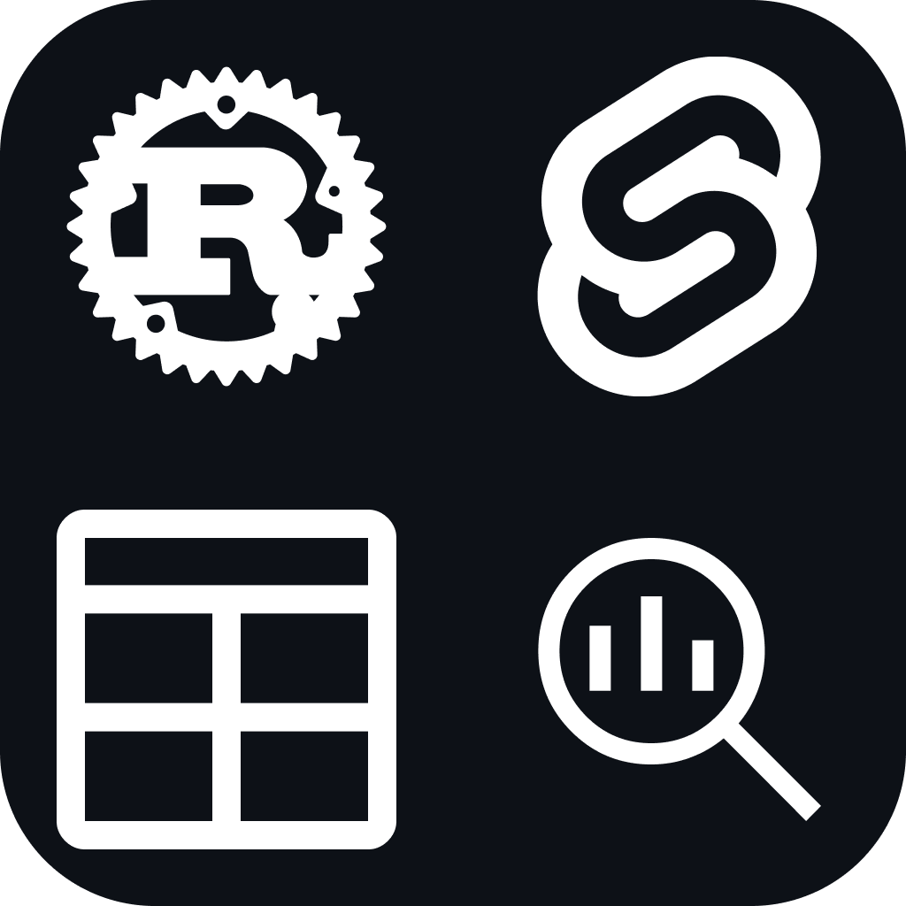

# OpenParquet


**OpenParquet** é um visualizador de arquivos Apache Parquet moderno, rápido e elegante. Construído para desenvolvedores e analistas de dados que precisam inspecionar grandes volumes de dados sem a sobrecarga de ferramentas pesadas.

<p align="center">
  
</p>

## 🚀 Funcionalidades Atuais

* **Alta Performance:** Backend em **Rust** com motor **DuckDB**.
* **Interface Moderna:** UI limpa em **Svelte** com Dark Mode.
* **Drag & Drop:** Arraste seus arquivos `.parquet` para abrir.
* **Paginação Eficiente:** Navegue por milhões de linhas.
* **Metadados Detalhados:** Schema e tipos de colunas.
* **Multiplataforma:** Windows, macOS e Linux.

## 🗺️ Roadmap (To-Do)

Estamos trabalhando ativamente para tornar o OpenParquet a ferramenta definitiva. Aqui está o que vem por aí:

- [x] **Ordenação de Colunas:** Ordenação nativa via SQL ao clicar no cabeçalho.
- [ ] **Preferências:** Salvar tema (Dark/Light) e tamanho da janela entre sessões.
- [ ] **Histórico:** Lista de arquivos abertos recentemente na tela inicial.
- [x] **Modo SQL:** Interface para rodar queries SQL personalizadas nos dados carregados.
- [ ] **Filtros Rápidos:** Barra de busca global e filtros por coluna.
- [x] **Exportação:** Exportar visualização atual para CSV ou JSON.
- [ ] **Abrir Pasta:** Carregar múltiplos arquivos Parquet de uma pasta como uma única tabela.
- [ ] **Testes E2E:** Implementar testes automatizados de interface.

> Quer ajudar a implementar alguma dessas features? Confira nosso [Guia de Contribuição](CONTRIBUTING.md)!

## 🛠️ Tech Stack

* **[Tauri v2](https://tauri.app/):** Framework para apps minúsculos e seguros.
* **[Rust](https://www.rust-lang.org/):** Lógica de backend.
* **[DuckDB](https://duckdb.org/):** Motor SQL embutido.
* **[Svelte](https://svelte.dev/):** Frontend reativo.
* **[TypeScript](https://www.typescriptlang.org/):** Tipagem estática.

## 📦 Instalação

Acesse a aba de **[Releases](https://github.com/rafaelqsantos-rqs/openparquet/releases)** para baixar a última versão.

## 🧑‍💻 Desenvolvimento

1.  Clone o repositório:
    ```bash
    git clone [https://github.com/rafaelqsantos-rqs/openparquet.git](https://github.com/rafaelqsantos-rqs/openparquet.git)
    cd openparquet
    ```

2.  Instale as dependências:
    ```bash
    npm install
    ```

3.  Rode em modo de desenvolvimento:
    ```bash
    npm run tauri dev
    ```

## 🤝 Contribuindo

Contribuições são muito bem-vindas! Veja o arquivo [CONTRIBUTING.md](CONTRIBUTING.md) para saber como começar.

## 📄 Licença

Este projeto está sob a licença MIT. Veja o arquivo [LICENSE](LICENSE) para mais detalhes.

---

Desenvolvido com 💚 por **[Rafael Santos](https://github.com/rafaelqsantos-rqs)**.
